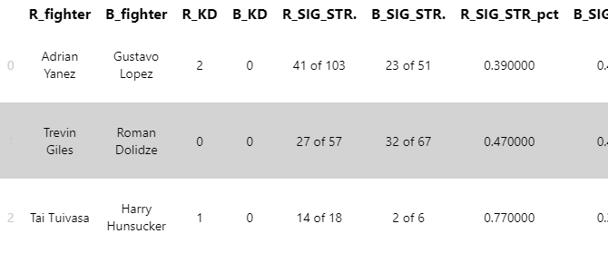
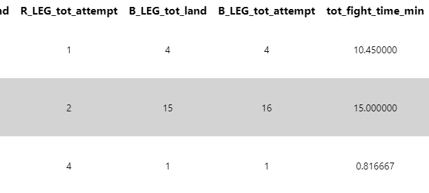
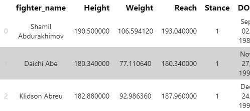
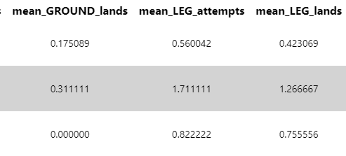
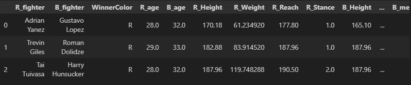
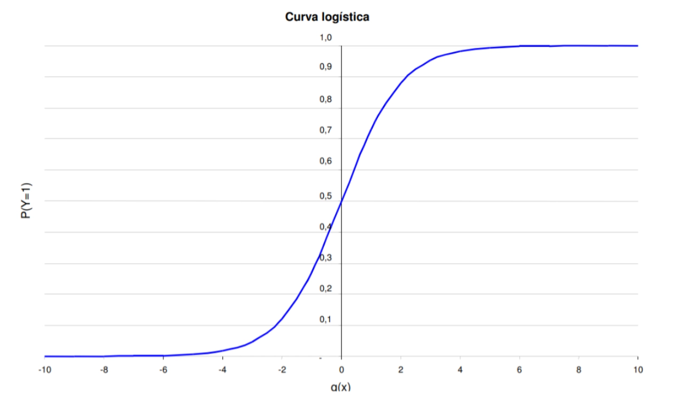
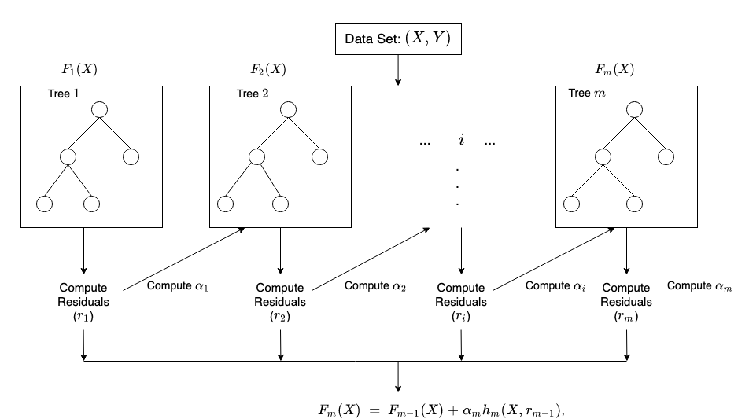
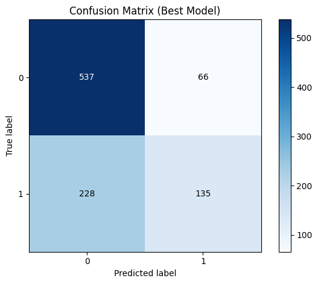
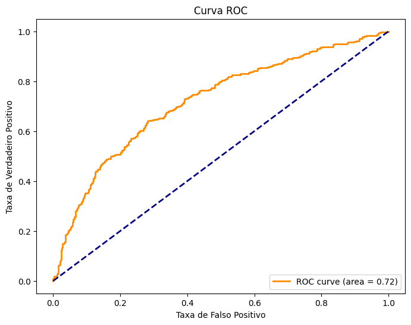

### Texto Corrido para a Apresentação

**Slide 0: Título e Introdução**
- **Caio**: "Olá, meu nome é Caio, e hoje eu, o Gabriel e o Luca, apresentaremos nosso projeto sobre a previsão dos vencedores de lutas de UFC utilizando modelos de Machine Learning."

**Slide 1: Objetivo do Projeto e Base de Dados**
- **Gabriel**: "O objetivo do nosso projeto é identificar o modelo de classificação mais adequado para prever os vencedores das lutas de UFC. Para isso, utilizamos uma base de dados do kaggle chamada 'UFC-Fight historical data', que contém informações, de 1993 a 2021, sobre os lutadores, as lutas e os resultados. A base de dados inclui variáveis como altura, peso, histórico de lutas, golpes conectados, tentativas de queda, entre outras. Nosso trabalho foi baseado em realizar o pré-processamento dos dados, selecionar features, treinar diferentes modelos de classificação e avaliar o desempenho de cada um."

- Imagens:

    - 

    - 

**Slide 2: Pré-processamento e Seleção de Features**
- **Caio**: "Primeiro, realizamos o pré-processamento dos dados. Isso envolveu a limpeza dos dados, removendo valores nulos e corrigindo inconsistências. Além disso, ajustamos as unidades da base, convertendo alturas de pés para centímetros, pesos de libras para quilogramas e percentuais para valores decimais. Também derivamos novos atributos, como o histórico de tentativas e golpes conectados dos lutadores. Para selecionar as features mais relevantes, analisamos a correlação entre as variáveis e o resultado das lutas, além de usar técnicas de engenharia de features para criar novas variáveis que pudessem melhorar a performance dos modelos. Dessa forma, agrupamos os dados dos lutadores com os dados das lutas, criando uma tabela final que seria usada para treinar os modelos."

- Imagens:

    - #  ••• 

    - #  ••• 

    - 

**Slide 3: Modelagem dos Dados**
- **Luca**: "Para a modelagem dos dados, utilizamos três modelos principais: Regressão Logística, Random Forest e XGBoost. Configuramos um pipeline de pré-processamento que incluía a padronização dos dados e a expansão polinomial das features. A padronização garante que todas as features tenham a mesma escala, enquanto a expansão polinomial gera novas features a partir das existentes, aumentando o poder preditivo do modelo. Utilizamos a técnica de validação cruzada `ShuffleSplit` com 50 divisões, o que nos permitiu testar diferentes configurações de hiperparâmetros e avaliar a robustez dos modelos. Dessa maneira, conseguimos encontrar a melhor configuração para cada modelo, assegurando que eles fossem bem treinados e testados de forma consistente."

- Imagens:

    - 

    - 

    - 

**Slide 4: Resultados dos Modelos**
- **Luca**: "Os resultados mostraram que o modelo de Regressão Logística com *`C`* igual a 0.001 e penalidade *`l2`* teve o melhor desempenho, com uma acurácia de 69.6%. O valor de *`C`* determina a força da regularização, onde um valor menor de *`C`* implica em uma regularização mais forte, ajudando a evitar overfitting. A penalidade *`l2`* adiciona um termo de regularização que penaliza grandes coeficientes, promovendo um modelo mais simples. No entanto, é importante notar que, embora a Regressão Logística tenha se destacado, a diferença de desempenho em relação a muitos outros modelos testados não foi estatisticamente significativa. A matriz de confusão mostrou que este modelo teve 537 verdadeiros positivos, 66 falsos positivos, 135 verdadeiros negativos e 228 falsos negativos. Também plotamos a curva ROC para visualizar a taxa de verdadeiros positivos versus a taxa de falsos positivos, e a área sob a curva foi razoável, indicando um desempenho aceitável do modelo. Contudo, é importante notar que o modelo não superou drasticamente o desempenho do modelo Dummy, que teve uma acurácia de 62.4%."

- Imagens:

    - 

    - 

**Slide 5: Conclusões e Referências**
- **Gabriel**: "Em conclusão, ao analisar os resultados, constatamos que o modelo de Regressão Logística com C igual a 0.001 e penalidade l2 teve um bom desempenho, mas a diferença para muitos outros modelos testados não foi estatisticamente significativa. Isso sugere que, embora seja um forte candidato, a Regressão Logística não é consistentemente superior a todos os modelos em todos os cenários. Os modelos como Random Forest e XGBoost também apresentaram bom desempenho e podem ser considerados alternativas viáveis dependendo do contexto específico. Dessa forma, nosso projeto fornece insights ótimos para futuras pesquisas e aplicações na área de análise de desempenho esportivo, oferecendo uma base sólida para o desenvolvimento de abordagens mais precisas e efetivas na previsão dos resultados das lutas de UFC. Como já citamos anteriormente, utilizamos dados do Kaggle e, também, ferramentas como o ChatGPT para desenvolver este projeto. As referências completas podem ser encontradas nos links fornecidos no notebook. Obrigado!"